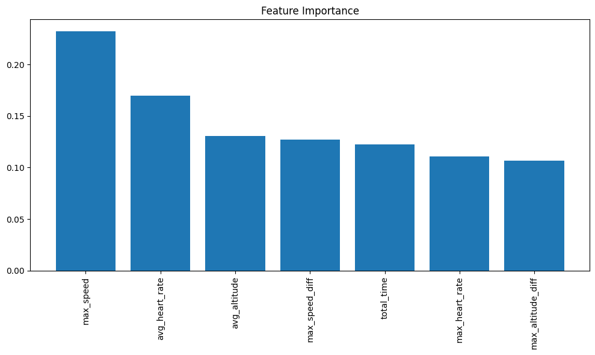

## IT5100F - Report for Assignment 1-3

## Table of content
- [IT5100F - Assignment 1](#it5100f---assignment-1-1)
    - [Part 1: Data Preprocessing](#part-1-data-preprocessing)
      - [1.1 Data Loading](#11-data-loading)
          - [Import Libraries](#import-libraries)
      - [1.2 Data Cleaning](#12-data-cleaning)
          - [Dealing with null values:](#dealing-with-null-values)
          - [Dealing with consistency:](#dealing-with-consistency)
          - [Expanding dataset](#expanding-dataset)
          - [Converting Timestamp](#converting-timestamp)
          - [Double checking for missing values](#double-checking-for-missing-values)
      - [1.3 Data Storage](#13-data-storage)
    - [Part 2: EDA \& Data Visualization](#part-2-eda--data-visualization)
      - [2.1 Bar chart for number of workouts by Sport](#21-bar-chart-for-number-of-workouts-by-sport)
      - [2.3 Heatmap for specific user activities](#23-heatmap-for-specific-user-activities)
- [IT5100F - Assignment 2](#it5100f---assignment-2)
    - [Part 3: Supervised Learning - Regression](#part-3-supervised-learning---regression)
      - [3.1: Data Preperation and Feature Engineering](#31-data-preperation-and-feature-engineering)
          - [Compute Heart Rate Difference](#compute-heart-rate-difference)
          - [Compute Speed Difference](#compute-speed-difference)
          - [Compute Altitude Difference](#compute-altitude-difference)
          - [Compute Time Elapsed](#compute-time-elapsed)
          - [Remove NaN values](#remove-nan-values)
      - [3.2: Model Training and Application](#32-model-training-and-application)
          - [Define the Features and Target Variable](#define-the-features-and-target-variable)
          - [Split the data into training and testing sets](#split-the-data-into-training-and-testing-sets)
          - [Train a Linear Regression model](#train-a-linear-regression-model)
          - [Make predictions on the test set](#make-predictions-on-the-test-set)
      - [3.3: Model Evaluation and Visualization](#33-model-evaluation-and-visualization)
          - [Compute the Mean Squared Error (MSE)](#compute-the-mean-squared-error-mse)
          - [Calculate the Mean Absolute Error (MAE)](#calculate-the-mean-absolute-error-mae)
          - [Visualize the predicted vs actual heart rate changes](#visualize-the-predicted-vs-actual-heart-rate-changes)
      - [3.4: Model Improvement with More Features (Multivariate Regression)](#34-model-improvement-with-more-features-multivariate-regression)
          - [Define the Features and Target Variable](#define-the-features-and-target-variable-1)
          - [Check Correlation between Features](#check-correlation-between-features)
          - [Split the data into training and testing sets](#split-the-data-into-training-and-testing-sets-1)
          - [Train a Linear Regression model](#train-a-linear-regression-model-1)
          - [Make predictions on the test set](#make-predictions-on-the-test-set-1)
          - [Compute the Mean Squared Error (MSE)](#compute-the-mean-squared-error-mse-1)
          - [Compute the Mean Absolute Error (MSE)](#compute-the-mean-absolute-error-mse)
          - [Visualize the changes in heart rate predicted by the model](#visualize-the-changes-in-heart-rate-predicted-by-the-model)
      - [3.5 Model Comparison](#35-model-comparison)
          - [Comparison of Model Performance](#comparison-of-model-performance)
          - [Evaluation of Regrrerssion Models](#evaluation-of-regrrerssion-models)
- [IT5100F - Assignment 3](#it5100f---assignment-3)
    - [Part 4: Unsupervised Learning](#part-4-unsupervised-learning)
      - [4.0 Import libraries, load and show basic information of dataset](#40-import-libraries-load-and-show-basic-information-of-dataset)
          - [Import required libraries](#import-required-libraries)
          - [Load the data from assignment 1](#load-the-data-from-assignment-1)
          - [Display basic information for dataset](#display-basic-information-for-dataset)
      - [4.1: Data Preprocessing for Clustering](#41-data-preprocessing-for-clustering)
          - [Filter Data for Specific Sport](#filter-data-for-specific-sport)
          - [Checking data type and convert them into desired type](#checking-data-type-and-convert-them-into-desired-type)
          - [Generate Average Speed Dataset](#generate-average-speed-dataset)
          - [Compute Total Workout Time](#compute-total-workout-time)
          - [Compute Total Distance Covered](#compute-total-distance-covered)
          - [Merge Processed Data](#merge-processed-data)
      - [4.2: Determine the Optimal Number of Clusters](#42-determine-the-optimal-number-of-clusters)
          - [Run K-Means for Different Cluster Numbers](#run-k-means-for-different-cluster-numbers)
          - [Elbow Method for Optimal Clusters](#elbow-method-for-optimal-clusters)
      - [4.3: Cluster Analysis and Visualization](#43-cluster-analysis-and-visualization)
          - [Identify the Cluster Number for Each User](#identify-the-cluster-number-for-each-user)
          - [Visualize the Clusters](#visualize-the-clusters)
          - [Identify Similar Users](#identify-similar-users)
    - [Part5: Free-form Exploration: Two Analysis Tasks](#part5-free-form-exploration-two-analysis-tasks)
      - [5.1 Workouts Differentiation by Sport](#51-workouts-differentiation-by-sport)
          - [Import Libraries and data loading](#import-libraries-and-data-loading)
        - [Data Preperation and Feature Engineering](#data-preperation-and-feature-engineering)
          - [Plot Workouts by Sport](#plot-workouts-by-sport)
          - [Filter Two Main Workout Types: Run and Bike](#filter-two-main-workout-types-run-and-bike)
          - [Compute Average Features](#compute-average-features)
        - [Model Training and Application](#model-training-and-application)
          - [Define the Features and Label](#define-the-features-and-label)
          - [Split the data into training and testing sets](#split-the-data-into-training-and-testing-sets-2)
          - [Feature Standardization](#feature-standardization)
          - [Train a Random Forest Model](#train-a-random-forest-model)
          - [Make predictions on the test set](#make-predictions-on-the-test-set-2)
        - [Model Evaluation and Visualization](#model-evaluation-and-visualization)
          - [Generate Classification Report](#generate-classification-report)
          - [Plot Confusion Matrix](#plot-confusion-matrix)
          - [Compute Precision, Recall, F1-score](#compute-precision-recall-f1-score)
          - [Check Feature Importance](#check-feature-importance)
          - [Visualize Feature Importance](#visualize-feature-importance)
        - [Model Performance Evaluation:](#model-performance-evaluation)
      - [5.2. Workout Performance Evaluation for Runners](#52-workout-performance-evaluation-for-runners)
        - [Import Libraries and data loading](#import-libraries-and-data-loading-1)
        - [Data Preperation and Feature Engineering](#data-preperation-and-feature-engineering-1)
          - [Filter Out Workout: RUN](#filter-out-workout-run)
          - [Derive Advanced Features](#derive-advanced-features)
          - [Compute Average Speed to Heart Rate Ratio](#compute-average-speed-to-heart-rate-ratio)
          - [Classify Performance on Quantile](#classify-performance-on-quantile)
        - [Model Training and Application](#model-training-and-application-1)
          - [Define the Features and Label](#define-the-features-and-label-1)
          - [Split the data into training and testing sets](#split-the-data-into-training-and-testing-sets-3)
          - [Train a Random Forest Model](#train-a-random-forest-model-1)
          - [Make predictions on the test set](#make-predictions-on-the-test-set-3)
        - [Model Evaluation and Visualization](#model-evaluation-and-visualization-1)
          - [Generate Classification Report](#generate-classification-report-1)
          - [Plot Confusion Matrix](#plot-confusion-matrix-1)
          - [Compute Precision, Recall, F1-score](#compute-precision-recall-f1-score-1)
          - [Check Feature Importance](#check-feature-importance-1)
          - [Visualize Feature Importance](#visualize-feature-importance-1)
        - [Model Performance Evaluation:](#model-performance-evaluation-1)

### IT5100F - Assignment 1

- Part 1: Data Preprocessing
  - 1.1 Data Loading
    - Import Libraries
  - 1.2 Data Cleaning
    - Dealing with null values
    - Dealing with consistency
    - Expanding dataset
    - Converting Timestamp
    - Double checking for missing values
  - 1.3 Data Storage

## Team submitting the assignment

| Team member | Name          | NUSNet ID (exxxxxxx) | Student number (AxxxxxxxZ) |
| ----------- | ------------- | -------------------- | -------------------------- |
| 1           | Dong Suhong   | E1326008             | A0290555Y                  |
| 2           | Shi Ruyi      | E1326003             | A0290550J                  |
| 3           | Tan Changjie  | E1330333             | A0291194Y                  |
| 4           | Zhang Haochen | E1326060             | A0290607A                  |


# IT5100F - Assignment 1

Dataset:

- Endomondo Dataset comprises of sport records from Endomondo, a fitness tracking website.
    - It includes sensory data such as heart rate, speed, and longitude, collected from various users during different workouts.

- Download the dataset from the following link: [Endomondo dataset](https://drive.google.com/file/d/1HLgCkCIBmkso2kGzGDHVTtlLzPBEsh_m/view?usp=drive_link)

### Part 1: Data Preprocessing

Durting this part, we will firstly load dataset to a date frame in python. Then we will deal with missing values, inconsistency, exploding attributes to get the data ready for the following EDA and model analysis.

#### 1.1 Data Loading

###### Import Libraries

Here we import necessary libraries for the follwoing analysis.


```python
import pandas as pd
import numpy as np
import matplotlib.pyplot as plt
import seaborn as sns
```

In this project, we are using `endomondo` dataset downloaded from the link  [Endomondo dataset](https://drive.google.com/file/d/1HLgCkCIBmkso2kGzGDHVTtlLzPBEsh_m/view?usp=drive_link).

 First step is to load the dataset to a data frame using `read_json`.


```python
from google.colab import drive
drive.mount('/content/drive')
file_path = '/content/drive/MyDrive/IT5100F/endomondo_proper.json'
endomondo_df = pd.read_json(file_path, lines=True)
endomondo_df.head()
```


#### 1.2 Data Cleaning
###### Dealing with null values: 

Firstly, we use `is.null` for checking the numer of rows that contain missing values. `any(axis=1)` is used for checking null values across the columns. Afterwards, we decide to remove the rows that contain missing values by `.dropna()`


```python
# Find the total number of missing rows with null values in any column
total_missing = endomondo_df.isnull().any(axis=1).sum()
print(total_missing)

# Clean the data by removing rows with missing values
endomondo_cleaned_df = endomondo_df.dropna()
print(f"Cleaned data has {endomondo_cleaned_df.shape[0]} rows and {endomondo_cleaned_df.shape[1]} columns.")

# Check if there are any remaining null values in the cleaned dataset
remaining_nulls = endomondo_cleaned_df.isnull().sum().sum()
print(f"Remaining null values after cleaning: {remaining_nulls}")

# Print the shape of the cleaned data (number of rows and columns)
print(f"Cleaned data shape: {endomondo_cleaned_df.shape}")

# Display the first few rows of the cleaned data to verify its integrity
print(endomondo_cleaned_df.head())
```

    Remaining null values after cleaning: 0
    Cleaned data shape: (19391, 8)
                                                altitude  \
    0  [41.6, 40.6, 40.6, 38.4, 37.0, 34.0, 34.0, 34....   
    1  [38.4, 39.0, 39.0, 38.2, 36.8, 36.8, 36.8, 35....   
    2  [28.6, 29.4, 29.4, 29.4, 28.0, 27.0, 25.2, 23....   
    3  [24.0, 24.0, 24.0, 21.0, 18.6, 17.4, 17.4, 17....   
    4  [21.2, 22.0, 22.0, 20.6, 19.8, 19.4, 17.6, 15....   
    
                                              heart_rate           id  \
    0  [100, 111, 120, 119, 120, 116, 125, 128, 131, ...  396826535.0   
    1  [100, 105, 111, 110, 108, 115, 126, 130, 132, ...  392337038.0   
    2  [99, 105, 113, 109, 112, 116, 116, 114, 114, 1...  386729739.0   
    3  [118, 118, 119, 120, 122, 124, 126, 129, 133, ...  381185226.0   
    4  [100, 98, 104, 104, 107, 109, 108, 105, 105, 1...  371302193.0   
    
                                                latitude  \
    0  [60.1733487658, 60.1732398011, 60.1729802135, ...   
    1  [60.1732475962, 60.1732096262, 60.1729796268, ...   
    2  [60.1732862368, 60.1732394658, 60.1730676368, ...   
    3  [60.173279196, 60.1732723229, 60.1732617617, 6...   
    4  [60.1732459199, 60.173199987, 60.1730691455, 6...   
    
                                               longitude  \
    0  [24.6497704089, 24.650142733, 24.650910683, 24...   
    1  [24.6498552337, 24.6501554735, 24.6508813463, ...   
    2  [24.6498743445, 24.6502427291, 24.6508224215, ...   
    3  [24.6498169284, 24.6498684771, 24.6500092093, ...   
    4  [24.650183385200002, 24.6504225209, 24.6508663...   
    
                                                   speed             sport  \
    0  [6.8652, 16.4736, 19.1988, 20.4804, 31.3956, 3...              bike   
    1  [9.0792, 13.284, 15.9336, 10.9476, 16.1676, 30...              bike   
    2  [7.4988, 15.4008, 17.8668, 21.5712, 24.1416, 3...              bike   
    3  [7.218, 9.8208, 14.3532, 16.2972, 20.1276, 20....  bike (transport)   
    4  [16.4124, 11.682, 18.162, 21.7728, 24.408, 26....              bike   
    
                                               timestamp  
    0  [1408898746, 1408898754, 1408898765, 140889877...  
    1  [1408221682, 1408221687, 1408221699, 140822170...  
    2  [1407432042, 1407432048, 1407432056, 140743206...  
    3  [1406647079, 1406647080, 1406647082, 140664708...  
    4  [1405100572, 1405100576, 1405100582, 140510059...  


###### Dealing with consistency:

we apply `apply(len)` function for checking attributes' length for each row. Then, we apply an if-statement for checking whether all attributes have the same length in each row, thus ensure the consistency in the dataset.

```python
# Ensure consistency by verifying that the number of entries in the altitude, latitude, longitude, timestamp, heart_rate, and speed arrays is the same for each id

# Calculate the lengths of each relevant column
altitude_lens = endomondo_cleaned_df['altitude'].apply(len)
heart_rate_lens = endomondo_cleaned_df['heart_rate'].apply(len)
speed_lens = endomondo_cleaned_df['speed'].apply(len)
latitude_lens = endomondo_cleaned_df['latitude'].apply(len)
longitude_lens = endomondo_cleaned_df['longitude'].apply(len)
timestamp_lens = endomondo_cleaned_df['timestamp'].apply(len)

# Verify if all lengths are equal
if (altitude_lens.equals(heart_rate_lens) and
    heart_rate_lens.equals(speed_lens) and
    speed_lens.equals(latitude_lens) and
    latitude_lens.equals(longitude_lens) and
    longitude_lens.equals(timestamp_lens)):
    print("All entries have consistent lengths.")
else:
    print("Inconsistency found in the length of data columns.")

```

    All entries have consistent lengths.

From last one, in our dataset, it prints out "All entries have consistent lengths". Here we find another way to double check consistency. We identify a dataframe to include all inconsistent rows via condition:  `len(latitude) != len(longitude) != len(altitude) != len(timestamp) != len(heart_rate) != len(speed)` . Then we print out the dataframe, which shows empty, informed that we do not have any inconsistent rows.

```python
# Check if there are any rows with len(latitude) != len(longitude) != len(altitude) != len(timestamp) != len(heart_rate) != len(speed)
inconsistent_rows = endomondo_cleaned_df[(altitude_lens != heart_rate_lens) | (altitude_lens != speed_lens) | (altitude_lens != latitude_lens) | (altitude_lens != longitude_lens) | (altitude_lens != timestamp_lens) | (latitude_lens != longitude_lens) | (latitude_lens != timestamp_lens) | (latitude_lens != heart_rate_lens) | (latitude_lens != speed_lens) | (longitude_lens != timestamp_lens) | (longitude_lens != heart_rate_lens) | (longitude_lens != speed_lens) | (timestamp_lens != heart_rate_lens) | (timestamp_lens != speed_lens) | (heart_rate_lens != speed_lens)]

# Print the inconsistent rows
print(inconsistent_rows)
```

    Empty DataFrame
    Columns: [altitude, heart_rate, id, latitude, longitude, speed, sport, timestamp]
    Index: []


###### Expanding dataset 

We use `explode()` for unpacking arrays for each attributes into individual rows. Then we apply `.reset_index()` for clean indices. For example, previously for one attribute 'speed' in one row is an array like  [3.5,3.6,3.7] , then now it will divide into three rows with the same id and each row only contain one values [3.5], [3.6],[3.7] respectively.

```python
# Transform the dataset by expanding each array (altitude, latitude, longitude, timestamp, heart_rate, speed)
# associated with id into individual columns, making sure each column holds a single value from the array.
# Explode each array column to expand them into individual rows
endomondo_expanded_df = endomondo_cleaned_df.explode(['altitude', 'latitude', 'longitude', 'timestamp', 'heart_rate', 'speed'])
# Reset the index after explosion to ensure clean indices
endomondo_expanded_df = endomondo_expanded_df.reset_index(drop=True)
# Print the first few rows to check the transformation
print(endomondo_expanded_df.head())

```

      altitude heart_rate           id   latitude  longitude    speed sport  \
    0     41.6        100  396826535.0  60.173349   24.64977   6.8652  bike   
    1     40.6        111  396826535.0   60.17324  24.650143  16.4736  bike   
    2     40.6        120  396826535.0   60.17298  24.650911  19.1988  bike   
    3     38.4        119  396826535.0  60.172478  24.650669  20.4804  bike   
    4     37.0        120  396826535.0  60.171861  24.649145  31.3956  bike   
    
        timestamp  
    0  1408898746  
    1  1408898754  
    2  1408898765  
    3  1408898778  
    4  1408898794  

###### Converting Timestamp 

Here we convert time related attributes via  `.to_datetime()`, which allows us for time-based operations.

```python
# TODO: Convert the timestamp column from seconds to a datetime object.
endomondo_expanded_df["timestamp"] = pd.to_datetime(endomondo_expanded_df["timestamp"], unit='s')

# Print the first few rows to verify the conversion
print(endomondo_expanded_df[["timestamp"]].head())

```

                timestamp
    0 2014-08-24 16:45:46
    1 2014-08-24 16:45:54
    2 2014-08-24 16:46:05
    3 2014-08-24 16:46:18
    4 2014-08-24 16:46:34


###### Double checking for missing values

After transformations like removing inconsistent rows, exploding attributes and converting timestamp, we check the missing values rows again to make sure no missing rows from this stage.

```python
# Check and ensure there are no null values in the dataset after the transformation.
total_missing = endomondo_expanded_df.isnull().sum().sum()
# Print the total number of missing values
print(total_missing)
```

    0


#### 

#### 1.3 Data Storage

Save the processed data for further use


```python
CSV_FILE_NAME = "endomondo_proper_cleaned_expanded.csv"
# Save the cleaned and transformed dataset to a new CSV file with the CSV_FILE_NAME
endomondo_expanded_df.to_csv(CSV_FILE_NAME, index=False)

# Print confirmation message
print(f"Dataset saved to {CSV_FILE_NAME}")
```


### Part 2: EDA & Data Visualization
In Part 2, we will draw bar chart and heatmaps to illustrate relationships between attributes.

#### 2.1 Bar chart for number of workouts by Sport 

Firstly, we want to find out how many different sports that people plays in the dataset by `.nunique()`. In the edomondo dataset, there are 14 different sports in total.

Secondly, we import `matplotlib.pyplot` library for drawing bar chart. The x-axis represents the sport name and y-axis shows the number of workouts related to each sport. We count the number of workouts for each sport by `.value_counts()`.


```python
import matplotlib.pyplot as plt

# Find the total number of unique sports in the dataset
num_unique_sports = endomondo_expanded_df['sport'].nunique()

# Create a bar chart that visualizes the number of workouts associated with each sport.
# Count the number of workouts for each sport
sport_counts = endomondo_expanded_df['sport'].value_counts()

# Create the bar chart
plt.figure(figsize=(10, 6))
sport_counts.plot(kind='bar')

# Add titles and labels
plt.title('Number of Workouts by Sport')
plt.xlabel('Sport')
plt.ylabel('Number of Workouts')
plt.show()

```


    

#### 2.3 Heatmap for specific user activities

Firstly, we filter out the specific user. Then, we draw a heatmap with x-axis for longitude, y-axis for altitude, the color for altitude for the specific user with palette set to  `viridis` .

```python
USER_ID = 9633831
PALLETE_NAME = "viridis"
#  Plot Heatmap with longitude and latitude on the x and y axes, respectively, and color the points based on the Altitude.
import seaborn as sns
# Filter the data for the specific user
user_data = endomondo_expanded_df[endomondo_expanded_df['id'] == USER_ID]
plt.figure(figsize=(10, 8))
# Use scatter plot to show longitude and latitude, with altitude as the color
scatter = plt.scatter(user_data['longitude'], user_data['latitude'],
                      c=user_data['altitude'], cmap=PALLETE_NAME, s=10)
plt.colorbar(scatter, label='Altitude')
plt.title(f"Heatmap of Longitude and Latitude with Altitude for User {USER_ID}")
plt.xlabel('Longitude')
plt.ylabel('Latitude')
plt.show()
```


​    

​    


- Repeat the same process as before. While in the heatplot, the color is for heart rate and we change the palette to `magma`. 


```python
USER_ID = 9633831
PALLETE_NAME = "magma"

# Plot Heatmap with longitude and latitude on the x and y axes, respectively, and color the points based on the Heart Rate.
import matplotlib.pyplot as plt
import seaborn as sns
# Filter the data for the specific user
user_data = endomondo_expanded_df[endomondo_expanded_df['id'] == USER_ID]
plt.figure(figsize=(10, 8))
# Use scatter plot to show longitude and latitude, with heart_rate as the color
scatter = plt.scatter(user_data['longitude'], user_data['latitude'],
                      c=user_data['heart_rate'], cmap=PALLETE_NAME, s=10)
# Add color bar for heart rate
plt.colorbar(scatter, label='Heart Rate')
# Add labels and title
plt.title(f"Heatmap of Longitude and Latitude with Heart Rate for User {USER_ID}")
plt.xlabel('Longitude')
plt.ylabel('Latitude')
plt.show()
```


This notebook visualized a fitness dataset, specifically creating heatmap scatter plots based on geographic coordinates, heart rate, and altitude data for individual users. These visualizations offer insights into the variations in altitude and heart rate during workouts at different locations. Additional analysis and visualizations could focus on other aspects of the dataset, such as speed, distance, or comparisons between multiple users. 

# IT5100F - Assignment 2
### Part 3: Supervised Learning - Regression
In Part 3, we perform supervised learning techniques by building a regression model to predict changes in heart rate based on features extracted from a dataset of user workout records. We will continue with the dataset in Assignment1.

#### 3.1: Data Preperation and Feature Engineering

Below we will add more attribute for the difference in heart rate, speed, altitude and time. Afterwards, we check the missing values again and remove them, which caused by diff operations for the following analysis.

###### Compute Heart Rate Difference

Here we add one more column names as `heart_rate_diff` , which is used to record the difference between the current heart rate and the previous heart rate for each user. Then, we first group by 'id', then apply `.diff()` for heart rate difference.


```python
# Add a new column to the dataframe called `heart_rate_diff` that calculates the difference between the current heart rate and the previous heart rate for each user.
endomondo_df['heart_rate_diff'] = endomondo_df.groupby('id')['heart_rate'].diff()
```

###### Compute Speed Difference

Here we add one more column names as `speed_diff` , which is used to record the difference in speed between the current and previous row for each user. Then, we first group by 'id', then apply `.diff()` for speed difference as before.


```python
# Add a new column to the dataframe called `speed_diff` that calculates the difference in speed between the current and previous row for each user.
endomondo_df['speed_diff'] = endomondo_df.groupby('id')['speed'].diff()
```

###### Compute Altitude Difference

Repeat same process as heart rate and speed for altitude.


```python
# Add a new column to the dataframe called `altitude_diff` that calculates the difference in altitude between the current and previous row for each user.
endomondo_df['altitude_diff'] = endomondo_df.groupby('id')['altitude'].diff()
```

###### Compute Time Elapsed

We converts the `timestamp` column in the `endomondo_df` DataFrame to a datetime format and then calculates the time elapsed since the first timestamp for each group of entries with the same `id`, storing the result in a new column called `time_elapsed`.


```python
# Add a new column to the dataframe called `time_elapsed` which is the difference between the start and current time in seconds
endomondo_df['timestamp'] = pd.to_datetime(endomondo_df['timestamp'])
endomondo_df['time_elapsed'] = endomondo_df.groupby('id')['timestamp'].transform(lambda x: x - x.min())
```


###### Remove NaN values
As we calculate the differences for heart rate speed and altitude, the first record for each user will not have a previous record to compare against resulting in `NaN` values. Use an appropriate method to handle these `Nan` values, ensuring a complete and consistent dataset for modeling.


```python
# Clean the data by removing rows with missing values
endomondo_df = endomondo_df.dropna()
```

```python
python
   altitude  heart_rate           id   latitude  longitude    speed sport  \
1      40.6         111  396826535.0  60.173240  24.650143  16.4736  bike   
2      40.6         120  396826535.0  60.172980  24.650911  19.1988  bike   
3      38.4         119  396826535.0  60.172478  24.650669  20.4804  bike   
4      37.0         120  396826535.0  60.171861  24.649145  31.3956  bike   
5      34.0         116  396826535.0  60.171545  24.648350  31.8096  bike   

            timestamp  heart_rate_diff  speed_diff  altitude_diff  \
1 2014-08-24 16:45:54             11.0      9.6084           -1.0   
2 2014-08-24 16:46:05              9.0      2.7252            0.0   
3 2014-08-24 16:46:18             -1.0      1.2816           -2.2   
4 2014-08-24 16:46:34              1.0     10.9152           -1.4   
5 2014-08-24 16:46:40             -4.0      0.4140           -3.0   

     time_elapsed  
1 0 days 00:00:08  
2 0 days 00:00:19  
3 0 days 00:00:32  
4 0 days 00:00:48  
5 0 days 00:00:54  
```

#### 3.2: Model Training and Application

Import required libraries for deploying regression model.


```python
from sklearn.model_selection import train_test_split
from sklearn.linear_model import LinearRegression
from sklearn.metrics import mean_squared_error, mean_absolute_error
```

###### Define the Features and Target Variable
- Features: 'Speed_diff'
- Target: 'Heart_rate_diff'

###### Split the data into training and testing sets

We then splits the dataset into training and testing sets with a very small test size (0.0001) and a fixed random state for reproducibility. Finally, it prints the sizes of the training and test sets.


```python
# Split the data into training and testing sets
# Get features
X_Features = ['speed_diff'] # Features to use as input for the model
Y_Features = ['heart_rate_diff'] # Features to predict
TEST_SIZE = 0.0001
RANDOM_STATE = 42
X = endomondo_df[X_Features]
y = endomondo_df[Y_Features]

# Split
X_train, X_test, y_train, y_test = train_test_split(X, y, test_size=TEST_SIZE, random_state=RANDOM_STATE)

# Print split dataset size
print(f'Training set size: {len(X_train)}')
print(f'Test set size: {len(X_test)}')
```

    Training set size: 9675141
    Test set size: 968

###### Train a Linear Regression model

We creates a linear regression model using `LinearRegression()`, trains it on the training data (`X_train` and `y_train`), and then prints the model's coefficients and intercept.


```python
# Train a linear regression model on the training data
# Create linear regression model
model = LinearRegression()

# Train the model
model.fit(X_train, y_train)

# Print coefficients and intercept of the model
print(f'Model coefficients: {model.coef_}')
print(f'Model intercept: {model.intercept_}')
```

    Model coefficients: [[0.09490635]]
    Model intercept: [0.0843423]

###### Make predictions on the test set

Using the trained linear regression model to predict heart rate changes (`y_pred`) based on the test data (`X_test`), and then prints the predicted values.


```python
#Predict the Changes in heart rate for the test data
y_pred = model.predict(X_test)

print('Predictions on the test set:')
print(y_pred)
```

#### 3.3: Model Evaluation and Visualization

Here we will conduct MSE and MAE to evaluate model perfomation on the test set. MSE measures the average of the squares of the errors between predicted and actual values, while MAE calculates the average of the absolute differences between predicted and actual values, both commonly used to evaluate model performance.

###### Compute the Mean Squared Error (MSE)


```python
# Calculate the mean squared error of the model on the test data and print it out
# MSE on the test set
mse = mean_squared_error(y_test, y_pred)
print('Mean Squared Error:', mse)
```

    Mean Squared Error: 12.982606208609976


###### Calculate the Mean Absolute Error (MAE)


```python
# Calculate the mean squared error of the model on the test data and print it out
# MAE on the test set
mae = mean_absolute_error(y_test, y_pred)
print('Mean Absolute Error:', mae)
```

    Mean Absolute Error: 2.0911087270830744

###### Visualize the predicted vs actual heart rate changes

We generates a scatter plot comparing the actual (`y_test`, in blue) and predicted (`y_pred`, in red) heart rate differences against `speed_diff`, with labels, a title, and a grid for better visualization.


```python
# Plot scatter plots
plt.figure(figsize=(10, 6))

# Actual target (in color blue) values
plt.scatter(X_test, y_test, color='blue', label='Actual Target Values', alpha=0.6)
# Predicted (in color red) values
plt.scatter(X_test, y_pred, color='red', label='Predicted Values', alpha=0.6)

plt.title('Actual Target & Predicted Values')
plt.xlabel('Speed_diff')
plt.ylabel('Heart_rate_diff')
plt.legend()
plt.grid(True)
plt.show()
```


​    

​    

#### 3.4: Model Improvement with More Features (Multivariate Regression)

We will deploy multivariate regression to include not only speed_diff, but include 2 attraibutes (speed_diff and altitude_diff) to build model for predicting heart_rate_diff.

###### Define the Features and Target Variable
- Features: 'Speed_diff', 'Altitude_diff'
- Target: 'Heart_rate_diff'


```python
X_Features = ['speed_diff', 'altitude_diff'] # Features to use as input for the model
Y_Features = ['heart_rate_diff'] # Features to predict
TEST_SIZE = 0.0001
RANDOM_STATE = 42
```

###### Check Correlation between Features

We generates a heatmap of the correlation matrix for the `X_Features`, displaying the strength of the relationships between them, with annotations and a color scheme for easy interpretation.


```python
# Plot a Correlation matrix of the X_Features
correlation_matrix = endomondo_df[X_Features].corr()
plt.figure(figsize=(8, 6))
sns.heatmap(correlation_matrix, annot=True, cmap='coolwarm', fmt='.2f')
plt.title('Correlation Matrix of X_Features')
plt.show()
```


    

###### Split the data into training and testing sets

set up training set and test set for the modeling as before.


```python
# Split the data into training and testing data
# Get features
X = endomondo_df[X_Features]
y = endomondo_df[Y_Features]

# Split
X_train, X_test, y_train, y_test = train_test_split(X, y, test_size=TEST_SIZE, random_state=RANDOM_STATE)

# Print split dataset size
print(f'Training set size: {len(X_train)}')
print(f'Test set size: {len(X_test)}')
```

    Training set size: 9675141
    Test set size: 968


###### Train a Linear Regression model


```python
# Train a linear regression model on the training data
# Create Multivariate linear regression model
model = LinearRegression()

# Train the model
model.fit(X_train, y_train)

# Print coefficients and intercept of the model
print(f'Model coefficients: {model.coef_}')
print(f'Model intercept: {model.intercept_}')
```

    Model coefficients: [[0.11247555 0.21428381]]
    Model intercept: [0.08436618]


###### Make predictions on the test set


```python
# Predict the Changes in heart rate for the test data
y_pred = model.predict(X_test)
print('Predictions on the test set:')
print(y_pred)
```


###### Compute the Mean Squared Error (MSE)


```python
# Calculate the mean squared error of the model on the test data and print it out
# MSE on the test set
mse = mean_squared_error(y_test, y_pred)
print('Mean Squared Error:', mse)
```

    Mean Squared Error: 12.516444902278938


###### Compute the Mean Absolute Error (MSE)


```python
# Calculate the mean absolute error of the model on the test data and print it out
# MAE on the test set
mae = mean_absolute_error(y_test, y_pred)
print('Mean Absolute Error:', mae)
```

    Mean Absolute Error: 2.0462808694143892


###### Visualize the changes in heart rate predicted by the model

```python
# Plot scatter plot(s)
# Focus only on the relationship between 'Speed_diff' and the predicted heart rate changes
speed_diff = X_test['speed_diff']
actual_heart_rate_diff = y_test['heart_rate_diff']
predicted_heart_rate_diff = y_pred.flatten()

plt.figure(figsize=(10, 6))

# Actual target (in color blue) values
plt.scatter(speed_diff, actual_heart_rate_diff, color='blue', label='Actual Target Values', alpha=0.6)
# Predicted (in color red) values
plt.scatter(speed_diff, predicted_heart_rate_diff, color='red', label='Predicted Values', alpha=0.6)

plt.title('Actual Target & Predicted Values')
plt.xlabel('Speed_diff')
plt.ylabel('Heart_rate_diff')
plt.legend()
plt.grid(True)

plt.show()
```


Explanation:

- In the scatter plot, the red prediction points are roughly distributed along a straight line, which shows that the model captures the strong linear relationship between speed_diff and heart_rate_diff
- Since the actual model takes both altitude_diff and speed_diff into account, and here we only focus on the relationship between speed_diff and predicted heart_rate_diff, the predicted heart_rate_diff is not a simple straight line.

#### 3.5 Model Comparison


###### Comparison of Model Performance
Linear Regression Model

- MSE: 12.9826
- MAE: 2.0911
- Scatter Plot: Model predictions forms a straight line.

Multivariate Linear Regression Model

- MSE: 12.5164
- MAE: 2.0463
- Scatter Plot: Model predictions are approximately distributed along a straight line.

###### Evaluation of Regrrerssion Models
Multivariate linear regression model performs better than linear regression model for the following reasons:
- **Error Performance:** MSE and MAE are both used to measure the prediction error of the model. The smaller the value, the more accurate the model's prediction and the smaller the error.   
MSE and MAE of multivariate linear regression model are slightly lower than those of linear regression model, indicating that the multivariate linear regression provides more accurate predictions overall.   
- **Scatter Plots:** Compared with linear regression model, multivariate linear regression model not only considers speed_diff, but also other features. It allows the model to better capture the multidimensional factors that affect the target variable, which is more in line with the actual situation and usually brings performance improvement when processing multi-feature data.


# IT5100F - Assignment 3
### Part 4: Unsupervised Learning

#### 4.0 Import libraries, load and show basic information of dataset

###### Import required libraries


```python
import pandas as pd
import numpy as np
import matplotlib.pyplot as plt
import seaborn as sns
from tqdm import tqdm
from sklearn.manifold import TSNE
from sklearn.decomposition import PCA
from scipy.spatial.distance import euclidean
tqdm.pandas()
```

###### Load the data from assignment 1


```python
from google.colab import drive
drive.mount('/content/drive')
```

    Drive already mounted at /content/drive; to attempt to forcibly remount, call drive.mount("/content/drive", force_remount=True).

```python
#Load the data from the previous assignment 1
file_path = '/content/drive/MyDrive/IT5100F/ASSI3/endomondo_proper_cleaned_expanded.csv'
endomondo_df = pd.read_csv(file_path)
```

###### Display basic information for dataset

Displaying the initial rows of the dataset allows us to examine the types of features it contains, providing a preliminary understanding of its structure.


```python
endomondo_df.head()
```

The info() method displays details about the DataFrame, such as the index dtype, columns, non-null counts, and memory usage. It offers a concise summary of the endomondo_df, giving us an overview of its structure.


```python
endomondo_df.info()
```

    <class 'pandas.core.frame.DataFrame'>
    RangeIndex: 9695500 entries, 0 to 9695499
    Data columns (total 8 columns):
     #   Column      Dtype  
    ---  ------      -----  
     0   altitude    float64
     1   heart_rate  int64  
     2   id          float64
     3   latitude    float64
     4   longitude   float64
     5   speed       float64
     6   sport       object 
     7   timestamp   object 
    dtypes: float64(5), int64(1), object(2)
    memory usage: 591.8+ MB


#### 4.1: Data Preprocessing for Clustering

###### Filter Data for Specific Sport

We begin by filtering the dataset to include only users engaged in the sport Bike. Before applying the filter, we use the value_counts() method to identify the various sports types and the number of entries associated with each sport in the dataset.


```python
sports_counts = endomondo_df['sport'].value_counts()
print(sports_counts)
```

    sport
    bike                       4579000
    run                        4256500
    bike (transport)            321500
    mountain bike               262000
    indoor cycling              201500
    walk                         30000
    fitness walking              12500
    cross-country skiing          8000
    core stability training       7000
    roller skiing                 6500
    skate                         4500
    orienteering                  3500
    kayaking                      1500
    hiking                        1500
    Name: count, dtype: int64


The `endomondo_df` dataset contains several sports, including `bike`, `run`, and `bike (transport)`. To filter for entries where the sport is `bike`, we use `==` to generate a boolean sequence, which is then applied to index the DataFrame, returning only rows where the sport is `bike`. The `copy()` method is used to create an independent copy of the filtered DataFrame, ensuring that any modifications made later do not impact the original dataset.


```python
# Filter the dataset to include only users engaged in the sport "bike"
bike_df = endomondo_df[endomondo_df['sport'] == 'bike'].copy()
```

###### Checking data type and convert them into desired type

Before moving on to the next step, we observe that the data types of the id and timestamp fields are float and str, which are not suitable. We will convert them to int and datetime types, respectively.


```python
print(type(bike_df.loc[0,'id']))
print(type(bike_df.loc[0,'timestamp']))
```

    <class 'numpy.float64'>
    <class 'str'>

```python
# Convert the 'timestamp' column to datetime format
bike_df['timestamp'] = pd.to_datetime(bike_df['timestamp'])
# Convert the 'id' column to integer type
bike_df['id'] = bike_df['id'].astype(int)
```


```python
bike_df.info()
```

    <class 'pandas.core.frame.DataFrame'>
    Index: 4579000 entries, 0 to 9666499
    Data columns (total 8 columns):
     #   Column      Dtype         
    ---  ------      -----         
     0   altitude    float64       
     1   heart_rate  int64         
     2   id          int64         
     3   latitude    float64       
     4   longitude   float64       
     5   speed       float64       
     6   sport       object        
     7   timestamp   datetime64[ns]
    dtypes: datetime64[ns](1), float64(4), int64(2), object(1)
    memory usage: 443.4+ MB

```python
bike_df.head() 
```


Even though we removed all the NA values in Assignment 1, we will verify for NA values again to confirm that none are present in the data.


```python
bike_df.isna().sum().sum()
```


    0


At this stage, we have successfully extracted a subset of the original dataset that includes only users who participated in the sport bike.

###### Generate Average Speed Dataset

Create a new dataset containing `user_ids` and their average speed (`avg_speed`).

We note that the corresponding field for `user_ids` is `id`. Using the `groupby()` method, we group the entries by `id`. Then, we select the `speed` column to isolate the speed values and apply the `mean()` method to calculate the average speed. This produces a DataFrame with `id` as the index and the average speed as the values. Finally, we use `reset_index()` to turn `id` into a separate column and rename the speed column to `avg_speed`.


```python
# Generate a new dataset containing user_ids and their average speed (avg_speed)
avg_speed_df = bike_df.groupby('id')['speed'].mean().reset_index()
avg_speed_df = avg_speed_df.rename(columns={'speed': 'avg_speed'})
print(len(avg_speed_df))
avg_speed_df.head()
```

    9158

<table border="1" class="dataframe">
  <thead>
    <tr style="text-align: right;">
      <th></th>
      <th>id</th>
      <th>avg_speed</th>
    </tr>
  </thead>
  <tbody>
    <tr>
      <th>0</th>
      <td>9633831</td>
      <td>29.879453</td>
    </tr>
    <tr>
      <th>1</th>
      <td>10544802</td>
      <td>29.825676</td>
    </tr>
    <tr>
      <th>2</th>
      <td>11426022</td>
      <td>25.096514</td>
    </tr>
    <tr>
      <th>3</th>
      <td>11639926</td>
      <td>24.416834</td>
    </tr>
    <tr>
      <th>4</th>
      <td>11908018</td>
      <td>30.805798</td>
    </tr>
  </tbody>
</table>


###### Compute Total Workout Time

Create a new dataset with `user_ids` and their total workout time (`workout_time`), computed as the difference in seconds between the minimum and maximum timestamp for each user.

First, we group the DataFrame by `id` and aggregate the timestamp values using the `agg()` function to calculate both the minimum and maximum timestamps for each user. We then use `reset_index()` to convert the grouped data into a flat DataFrame with a new index.

Next, we determine the workout duration by finding the difference between the maximum and minimum timestamps for each user, converting this difference into seconds with `dt.total_seconds()`. The result is stored in a new column named `workout_time`.

Finally, we keep only the `id` and `workout_time` columns, representing the total workout duration for each user.


```python
# Generate a new dataset with user_ids and their total workout time (workout_time),
# computed as the difference between the minimum and maximum timestamps in seconds for each user.

# Group by user ID and compute the total workout time

workout_time_df = bike_df.groupby('id')['timestamp'].agg(['min', 'max']).reset_index()
workout_time_df['workout_time'] = (workout_time_df['max'] - workout_time_df['min']).dt.total_seconds()
workout_time_df = workout_time_df[['id', 'workout_time']]

workout_time_df.head()
```

<table border="1" class="dataframe">
  <thead>
    <tr style="text-align: right;">
      <th></th>
      <th>id</th>
      <th>workout_time</th>
    </tr>
  </thead>
  <tbody>
    <tr>
      <th>0</th>
      <td>9633831</td>
      <td>4900.0</td>
    </tr>
    <tr>
      <th>1</th>
      <td>10544802</td>
      <td>4608.0</td>
    </tr>
    <tr>
      <th>2</th>
      <td>11426022</td>
      <td>7698.0</td>
    </tr>
    <tr>
      <th>3</th>
      <td>11639926</td>
      <td>8880.0</td>
    </tr>
    <tr>
      <th>4</th>
      <td>11908018</td>
      <td>11046.0</td>
    </tr>
  </tbody>
</table>


###### Compute Total Distance Covered

Create a new dataset with `user_ids` and the total distance (`total_distance`) covered by each user.

To calculate the total distance for each user, we use the formula: `distance = avg_speed * workout_time`. First, we merge the two previous DataFrames, then we multiply the `avg_speed` column by the `workout_time` column to obtain the `total_distance`.


```python
# Generate a new dataset with user_ids and the total distance (`total_distance`) covered by each user.
total_distance_df = pd.merge(workout_time_df, avg_speed_df, on='id')
total_distance_df['total_distance'] = total_distance_df['avg_speed'] * total_distance_df['workout_time']
total_distance_df = total_distance_df[['id', 'total_distance']]
total_distance_df.head()
```

<table border="1" class="dataframe">
  <thead>
    <tr style="text-align: right;">
      <th></th>
      <th>id</th>
      <th>total_distance</th>
    </tr>
  </thead>
  <tbody>
    <tr>
      <th>0</th>
      <td>9633831</td>
      <td>146409.318720</td>
    </tr>
    <tr>
      <th>1</th>
      <td>10544802</td>
      <td>137436.715008</td>
    </tr>
    <tr>
      <th>2</th>
      <td>11426022</td>
      <td>193192.967851</td>
    </tr>
    <tr>
      <th>3</th>
      <td>11639926</td>
      <td>216821.489472</td>
    </tr>
    <tr>
      <th>4</th>
      <td>11908018</td>
      <td>340280.840290</td>
    </tr>
  </tbody>
</table>


######  Merge Processed Data

Merge all the above datasets into a single DataFrame called `user_merged_df`.  
To merge all the DataFrames, we set `id` as the index and use the `pd.concat` function to concatenate the three DataFrames together.


```python
# Combine all the above datasets into a single DataFrame named `user_merged_df`.

avg_speed_df.set_index("id", inplace=True)
total_distance_df.set_index("id", inplace=True)
workout_time_df.set_index("id", inplace=True)

user_merged_df = pd.concat(
    [avg_speed_df, workout_time_df, total_distance_df], axis=1
).reset_index()

user_merged_df.head()
```


<table border="1" class="dataframe">
  <thead>
    <tr style="text-align: right;">
      <th></th>
      <th>id</th>
      <th>avg_speed</th>
      <th>workout_time</th>
      <th>total_distance</th>
    </tr>
  </thead>
  <tbody>
    <tr>
      <th>0</th>
      <td>9633831</td>
      <td>29.879453</td>
      <td>4900.0</td>
      <td>146409.318720</td>
    </tr>
    <tr>
      <th>1</th>
      <td>10544802</td>
      <td>29.825676</td>
      <td>4608.0</td>
      <td>137436.715008</td>
    </tr>
    <tr>
      <th>2</th>
      <td>11426022</td>
      <td>25.096514</td>
      <td>7698.0</td>
      <td>193192.967851</td>
    </tr>
    <tr>
      <th>3</th>
      <td>11639926</td>
      <td>24.416834</td>
      <td>8880.0</td>
      <td>216821.489472</td>
    </tr>
    <tr>
      <th>4</th>
      <td>11908018</td>
      <td>30.805798</td>
      <td>11046.0</td>
      <td>340280.840290</td>
    </tr>
  </tbody>
</table>


#### 4.2: Determine the Optimal Number of Clusters

###### Run K-Means for Different Cluster Numbers

Use `user_merged_df` to perform k-means clustering with cluster numbers ranging from 2 to 11.

First, we drop the `id` field, as it should not be included as a feature for clustering. We then apply `StandardScaler` to standardize the data by removing the mean and scaling it to unit variance. This is essential because k-means clustering relies on Euclidean distance, and without scaling, features with larger ranges could disproportionately affect the distance calculations.

Next, we run k-means clustering with cluster counts from 2 to 11 and collect the inertia values. We set `random_state` to ensure the results are reproducible.


```python
from sklearn.cluster import KMeans
from sklearn.preprocessing import StandardScaler

X = user_merged_df.drop(columns=["id"])
scaler = StandardScaler()
X = scaler.fit_transform(X)

inertia = []
cluster_range = range(2, 12)

for n_clusters in cluster_range:
    kmeans = KMeans(n_clusters=n_clusters, random_state=42)
    kmeans.fit(X)
    inertia.append(kmeans.inertia_)

print(inertia)
```

    [15168.299598080355, 10681.86194367218, 8863.346142508115, 7083.415034261779, 5887.5689848730335, 5189.091420621941, 4757.930468282854, 4243.862983974921, 3919.4003948357736, 3601.3000470406323]


###### Elbow Method for Optimal Clusters

Plot the inertia (y-axis) against the number of clusters (x-axis) to determine the optimal number of clusters using the Elbow Method.

The Elbow Method aids in selecting the appropriate number of clusters by pinpointing where the inertia begins to decrease at a slower rate.

In our graph, the inertia begins to decrease more gradually when the number of clusters reaches 6. Therefore, we conclude that the optimal number of clusters is 6.


```python
plt.figure(figsize=(8, 6))
plt.plot(cluster_range, inertia, marker='o', linestyle='-', color='b')
plt.title('K-Means Clustering Inertia for 2 to 11 Clusters')
plt.xlabel('Number of clusters')
plt.ylabel('Inertia')
plt.xticks(cluster_range)
plt.grid(True)
plt.show()
```


​    

​    


```python
best_cluster_number = 6
```

#### 4.3: Cluster Analysis and Visualization

###### Identify the Cluster Number for Each User

Create a k-means model using the features from `user_merged_df` and the optimal number of clusters identified in Task 2.

Add a new column named `cluster` to the DataFrame that assigns the corresponding cluster number to each user.


```python
# Build a k-means model using the features from `user_merged_df` and the optimal number of clusters identified in Task 2.
kmeans = KMeans(n_clusters=best_cluster_number, random_state=42)
kmeans.fit(X)

# Add a new column called `cluster` to the DataFrame, which indicates the cluster number assigned to each user.
user_merged_df['cluster'] = kmeans.labels_
user_merged_df.head()

```

<table border="1" class="dataframe">
  <thead>
    <tr style="text-align: right;">
      <th></th>
      <th>id</th>
      <th>avg_speed</th>
      <th>workout_time</th>
      <th>total_distance</th>
      <th>cluster</th>
    </tr>
  </thead>
  <tbody>
    <tr>
      <th>0</th>
      <td>9633831</td>
      <td>29.879453</td>
      <td>4900.0</td>
      <td>146409.318720</td>
      <td>1</td>
    </tr>
    <tr>
      <th>1</th>
      <td>10544802</td>
      <td>29.825676</td>
      <td>4608.0</td>
      <td>137436.715008</td>
      <td>1</td>
    </tr>
    <tr>
      <th>2</th>
      <td>11426022</td>
      <td>25.096514</td>
      <td>7698.0</td>
      <td>193192.967851</td>
      <td>4</td>
    </tr>
    <tr>
      <th>3</th>
      <td>11639926</td>
      <td>24.416834</td>
      <td>8880.0</td>
      <td>216821.489472</td>
      <td>4</td>
    </tr>
    <tr>
      <th>4</th>
      <td>11908018</td>
      <td>30.805798</td>
      <td>11046.0</td>
      <td>340280.840290</td>
      <td>0</td>
    </tr>
  </tbody>
</table>


###### Visualize the Clusters

Visualize the clusters using a scatter plot.

Since the dataset contains three features, we use a 3D scatter plot to display the results.


```python
# Visualize the clusters using a 3D scatter plot.
fig = plt.figure(figsize=(12, 10))
ax = fig.add_subplot(111, projection='3d')

scatter = ax.scatter(user_merged_df['avg_speed'],
                     user_merged_df['total_distance'],
                     user_merged_df['workout_time'],
                     c=user_merged_df['cluster'],
                     cmap='viridis')

ax.set_xlabel('Average Speed')
ax.set_ylabel('Total Distance')
ax.set_zlabel('Workout Time')
ax.set_title('3D Visualization of Clusters')

plt.colorbar(scatter)
plt.show()
```


​    

​    


To enhance visualization, we first apply Principal Component Analysis (PCA) to reduce the dimensionality of the features from 3 to 2. This transformation projects the data into two principal components, enabling us to visualize it using a 2D scatter plot.


```python
# Apply PCA to reduce the dimensionality from 3 to 2pca = PCA(n_components=2)
X_pca = pca.fit_transform(X)

pca_df = pd.DataFrame(data=X_pca, columns=['PC1', 'PC2'])
pca_df['cluster'] = user_merged_df['cluster'].values

plt.figure(figsize=(8,6))
sns.scatterplot(x='PC1', y='PC2', hue='cluster', palette='viridis', data=pca_df)
plt.title('PCA - 2D Visualization with Cluster Colors', fontsize=14)
plt.xlabel('Principal Component 1', fontsize=12)
plt.ylabel('Principal Component 2', fontsize=12)
plt.grid(True)
plt.show()
```


​    

​    


Next, we use the t-SNE method for dimensionality reduction. In this approach, we reduce the features to 2 components to visualize them using a 2D scatter plot.


```python
# Apply t-SNE for dimensionality reductiontsne = TSNE(n_components=2, random_state=42)
tsne_result = tsne.fit_transform(X)
user_merged_df['tsne1'] = tsne_result[:, 0]
user_merged_df['tsne2'] = tsne_result[:, 1]

plt.figure(figsize=(10, 8))
sns.scatterplot(x='tsne1', y='tsne2', hue='cluster', data=user_merged_df, palette='viridis')
plt.title('t-SNE of Clusters')
plt.xlabel('t-SNE Component 1')
plt.ylabel('t-SNE Component 2')
plt.show()
```


​    

​    


###### Identify Similar Users

Determine which cluster the user with ID: 377398220 belongs to.

Identify similar users (workout buddies) within that cluster to make recommendations based on their shared workout patterns.

To find the user's cluster, we filter the `id` field using the `==` operator for the target user ID.

Once we identify the user's cluster, we retrieve other users from the same cluster (excluding the target user with ID 377398220). We then calculate the similarity score using the Euclidean distance between the target user and each user in the cluster, based on relevant features (`avg_speed` and `total_distance`). We sort the users by this distance to identify the top-K users who are most similar to the target user.


```python
target_user_id = 377398220
target_user = user_merged_df[user_merged_df['id'] == target_user_id].iloc[0]
target_user_cluster = target_user['cluster']

similar_users = user_merged_df[
    (user_merged_df['cluster'] == target_user_cluster) &
    (user_merged_df['id'] != target_user_id)
].copy()

target_user_features = target_user[['avg_speed', 'total_distance']].values

similar_users['similarity'] = similar_users.apply(
    lambda row: euclidean(row[['avg_speed', 'total_distance']], target_user_features),
    axis=1
)

similar_users = similar_users.sort_values('similarity')

print(f"Target User (ID: {target_user_id}):")
print(f"Cluster: {target_user_cluster}")
print(f"Average Speed: {target_user['avg_speed']:.2f} km/h")
print(f"Total Distance: {target_user['total_distance']:.2f} km")
print(f"Workout Time: {target_user['workout_time']:.2f} seconds")
print("\nTop 5 similar users:")
for _, user in similar_users.head().iterrows():
    print(f"User ID: {user['id']}")
    print(f"  Average Speed: {user['avg_speed']:.2f} km/h")
    print(f"  Total Distance: {user['total_distance']:.2f} km")
    print(f"  Workout Time: {user['workout_time']:.2f} seconds")
    print(f"  Similarity Score: {user['similarity']:.2f}")
    print()

cluster_avg = user_merged_df[user_merged_df['cluster'] == target_user_cluster].mean()
print(f"Cluster {target_user_cluster} Averages:")
print(f"Average Speed: {cluster_avg['avg_speed']:.2f} km/h")
print(f"Total Distance: {cluster_avg['total_distance']:.2f} km")
print(f"Workout Time: {cluster_avg['workout_time']:.2f} seconds")
```

    Target User (ID: 377398220):
    Cluster: 3.0
    Average Speed: 28.78 km/h
    Total Distance: 108079.47 km
    Workout Time: 3756.00 seconds
    
    Top 5 similar users:
    User ID: 248753701.0
      Average Speed: 27.30 km/h
      Total Distance: 108081.08 km
      Workout Time: 3959.00 seconds
      Similarity Score: 2.18
    
    User ID: 67898654.0
      Average Speed: 24.47 km/h
      Total Distance: 108072.49 km
      Workout Time: 4416.00 seconds
      Similarity Score: 8.20
    
    User ID: 224376777.0
      Average Speed: 27.57 km/h
      Total Distance: 108110.86 km
      Workout Time: 3922.00 seconds
      Similarity Score: 31.40
    
    User ID: 413370913.0
      Average Speed: 25.91 km/h
      Total Distance: 108132.76 km
      Workout Time: 4173.00 seconds
      Similarity Score: 53.37
    
    User ID: 301826582.0
      Average Speed: 23.18 km/h
      Total Distance: 108006.47 km
      Workout Time: 4659.00 seconds
      Similarity Score: 73.21
    
    Cluster 3.0 Averages:
    Average Speed: 26.39 km/h
    Total Distance: 99962.53 km
    Workout Time: 3805.44 seconds


### Part5: Free-form Exploration: Two Analysis Tasks
1. Workouts Differentiation by Sport
2. Workout Performance Evaluation for Runners

Base on Random Forest

#### 5.1 Workouts Differentiation by Sport
The objective of this analysis task is to classify workout sessions into two distinct sports categories: run and bike. We utilize a machine learning model, specifically a Random Forest classifier, to differentiate between these sports based on key workout metrics such as speed, heart rate, and altitude.

**Dataset**:   

- We will use the dataset `endomondo_proper_cleaned_expanded.csv` generated in assignment 1, which provides relevant features for this task.

**Feature Engineering**:

Several advanced features are computed to aid in the classification
- **Total Time** (`total_time`):    
Total workout duration in seconds.
- **Average Latitude and Longitude** (`avg_latitude`, `avg_longitude`):    
Indicate geographic location of the workout.
- **Average Altitude** (`avg_altitude`):   
Reflects the elevation level during the workout.
- **Average Heart Rate** (`avg_heart_rate`):   
Assesses average cardiovascular load.
- **Average Speed** (`avg_speed`):   
Indicate workout intensity.

**Classification**:

- The Random Forest classifier is used to predict whether a session is a run or a bike ride.

**Standardization**:

- Although tree-based models like Random Forest are less sensitive to feature scaling, it's good practice to standardize or normalize continuous features like speed, heart rate, and altitude to improve model interpretability and potentially enhance performance.

**Model Selection**:

- In this task, we are working with data that includes multiple complex features (speed, heart rate, altitude, etc.) for classification. Therefore, Random Forest is more suitable than a single decision tree with better resistance to overfitting, stability and analysis ability.

**Model Evaluation**:

- The performance of the Random Forest model is evaluated using various metrics:
 - Accuracy
 - Confusion Matrix
 - Precision, Recall, and F1-score
 - Feature Importance


This model offers an efficient way to automatically classify workout sessions as either running or biking, based on the provided workout data, and offers insights into which features are most important for classification.

###### Import Libraries and data loading


```python
import pandas as pd
import numpy as np
import matplotlib.pyplot as plt
import seaborn as sns
from sklearn.model_selection import train_test_split
from sklearn.ensemble import RandomForestClassifier
from sklearn.preprocessing import StandardScaler
from sklearn.metrics import classification_report, accuracy_score
from sklearn.metrics import confusion_matrix
from sklearn.metrics import precision_score, recall_score, f1_score
```


```python
from google.colab import drive
drive.mount('/content/drive')
```

    Mounted at /content/drive

```python
# Load the data from the previous assignment
file_path = '/content/drive/MyDrive/Colab Notebooks/IT5100F/endomondo_proper_cleaned_expanded.csv'
endomondo_df = pd.read_csv(file_path)
print(endomondo_df.shape)

endomondo_df.head()
```

    (9695500, 8)


<table border="1" class="dataframe">
  <thead>
    <tr style="text-align: right;">
      <th></th>
      <th>altitude</th>
      <th>heart_rate</th>
      <th>id</th>
      <th>latitude</th>
      <th>longitude</th>
      <th>speed</th>
      <th>sport</th>
      <th>timestamp</th>
    </tr>
  </thead>
  <tbody>
    <tr>
      <th>0</th>
      <td>41.6</td>
      <td>100</td>
      <td>396826535.0</td>
      <td>60.173349</td>
      <td>24.649770</td>
      <td>6.8652</td>
      <td>bike</td>
      <td>2014-08-24 16:45:46</td>
    </tr>
    <tr>
      <th>1</th>
      <td>40.6</td>
      <td>111</td>
      <td>396826535.0</td>
      <td>60.173240</td>
      <td>24.650143</td>
      <td>16.4736</td>
      <td>bike</td>
      <td>2014-08-24 16:45:54</td>
    </tr>
    <tr>
      <th>2</th>
      <td>40.6</td>
      <td>120</td>
      <td>396826535.0</td>
      <td>60.172980</td>
      <td>24.650911</td>
      <td>19.1988</td>
      <td>bike</td>
      <td>2014-08-24 16:46:05</td>
    </tr>
    <tr>
      <th>3</th>
      <td>38.4</td>
      <td>119</td>
      <td>396826535.0</td>
      <td>60.172478</td>
      <td>24.650669</td>
      <td>20.4804</td>
      <td>bike</td>
      <td>2014-08-24 16:46:18</td>
    </tr>
    <tr>
      <th>4</th>
      <td>37.0</td>
      <td>120</td>
      <td>396826535.0</td>
      <td>60.171861</td>
      <td>24.649145</td>
      <td>31.3956</td>
      <td>bike</td>
      <td>2014-08-24 16:46:34</td>
    </tr>
  </tbody>
</table>


##### Data Preperation and Feature Engineering
###### Plot Workouts by Sport


```python
# Create a bar chart that visualizes the number of workouts associated with each sport.
# Count the number of workouts for each sport
sport_counts = endomondo_df['sport'].value_counts()

# Create the bar chart
plt.figure(figsize=(10, 6))
sport_counts.plot(kind='bar')

# Add titles and labels
plt.title('Number of Workouts by Sport')
plt.xlabel('Sport')
plt.ylabel('Number of Workouts')
plt.show()
```


​    

​    


###### Filter Two Main Workout Types: Run and Bike


```python
# Filter workout records for run and bike
endomondo_df = endomondo_df[endomondo_df['sport'].isin(['run', 'bike'])]
print(endomondo_df.shape)

endomondo_df.head()
```

    (8835500, 8)

<table border="1" class="dataframe">
  <thead>
    <tr style="text-align: right;">
      <th></th>
      <th>altitude</th>
      <th>heart_rate</th>
      <th>id</th>
      <th>latitude</th>
      <th>longitude</th>
      <th>speed</th>
      <th>sport</th>
      <th>timestamp</th>
    </tr>
  </thead>
  <tbody>
    <tr>
      <th>0</th>
      <td>41.6</td>
      <td>100</td>
      <td>396826535.0</td>
      <td>60.173349</td>
      <td>24.649770</td>
      <td>6.8652</td>
      <td>bike</td>
      <td>2014-08-24 16:45:46</td>
    </tr>
    <tr>
      <th>1</th>
      <td>40.6</td>
      <td>111</td>
      <td>396826535.0</td>
      <td>60.173240</td>
      <td>24.650143</td>
      <td>16.4736</td>
      <td>bike</td>
      <td>2014-08-24 16:45:54</td>
    </tr>
    <tr>
      <th>2</th>
      <td>40.6</td>
      <td>120</td>
      <td>396826535.0</td>
      <td>60.172980</td>
      <td>24.650911</td>
      <td>19.1988</td>
      <td>bike</td>
      <td>2014-08-24 16:46:05</td>
    </tr>
    <tr>
      <th>3</th>
      <td>38.4</td>
      <td>119</td>
      <td>396826535.0</td>
      <td>60.172478</td>
      <td>24.650669</td>
      <td>20.4804</td>
      <td>bike</td>
      <td>2014-08-24 16:46:18</td>
    </tr>
    <tr>
      <th>4</th>
      <td>37.0</td>
      <td>120</td>
      <td>396826535.0</td>
      <td>60.171861</td>
      <td>24.649145</td>
      <td>31.3956</td>
      <td>bike</td>
      <td>2014-08-24 16:46:34</td>
    </tr>
  </tbody>
</table>


###### Compute Average Features


```python
# Compute new features and generate new dataframe
endomondo_df['timestamp'] = pd.to_datetime(endomondo_df['timestamp'])

processed_df = endomondo_df.groupby('id').agg(
    avg_latitude=('latitude', 'mean'),  # Average Latitude
    avg_longitude=('longitude', 'mean'),  # Average Longitude
    avg_altitude=('altitude', 'mean'),  # Average Altitude
    avg_heart_rate=('heart_rate', 'mean'),  # Average Heart Rate
    avg_speed=('speed', 'mean'),  # Average Speed
    total_time=('timestamp', lambda x: (pd.to_datetime(x).max() - pd.to_datetime(x).min()).total_seconds()),  # Total Time
    sport=('sport', 'first')  # Fit Sport Type
).reset_index()

processed_df.head()
```


<table border="1" class="dataframe">
  <thead>
    <tr style="text-align: right;">
      <th></th>
      <th>id</th>
      <th>avg_latitude</th>
      <th>avg_longitude</th>
      <th>avg_altitude</th>
      <th>avg_heart_rate</th>
      <th>avg_speed</th>
      <th>total_time</th>
      <th>sport</th>
    </tr>
  </thead>
  <tbody>
    <tr>
      <th>0</th>
      <td>9633831.0</td>
      <td>55.401869</td>
      <td>11.261268</td>
      <td>12.5516</td>
      <td>137.402</td>
      <td>29.879453</td>
      <td>4900.0</td>
      <td>bike</td>
    </tr>
    <tr>
      <th>1</th>
      <td>10544802.0</td>
      <td>55.378049</td>
      <td>11.269396</td>
      <td>16.9572</td>
      <td>136.644</td>
      <td>29.825676</td>
      <td>4608.0</td>
      <td>bike</td>
    </tr>
    <tr>
      <th>2</th>
      <td>11426022.0</td>
      <td>59.084909</td>
      <td>10.144285</td>
      <td>36.7208</td>
      <td>154.328</td>
      <td>25.096514</td>
      <td>7698.0</td>
      <td>bike</td>
    </tr>
    <tr>
      <th>3</th>
      <td>11639926.0</td>
      <td>51.665524</td>
      <td>0.392160</td>
      <td>14.8336</td>
      <td>145.996</td>
      <td>24.416834</td>
      <td>8880.0</td>
      <td>bike</td>
    </tr>
    <tr>
      <th>4</th>
      <td>11908018.0</td>
      <td>55.389810</td>
      <td>11.424099</td>
      <td>41.7756</td>
      <td>139.628</td>
      <td>30.805798</td>
      <td>11046.0</td>
      <td>bike</td>
    </tr>
  </tbody>
</table>


##### Model Training and Application

###### Define the Features and Label


```python
# Extract required features and label
X = processed_df[['avg_latitude', 'avg_longitude', 'avg_altitude', 'avg_heart_rate', 'avg_speed', 'total_time']]
# Encode
y = processed_df['sport'].map({'run': 0, 'bike': 1})
```

###### Split the data into training and testing sets


```python
# Split training set and test set
X_train, X_test, y_train, y_test = train_test_split(X, y, test_size=0.15, random_state=42)

# Print split dataset size
print(f'Training set size: {len(X_train)}')
print(f'Test set size: {len(X_test)}')
```

    Training set size: 15020
    Test set size: 2651


###### Feature Standardization


```python
# Standardization
scaler = StandardScaler()
X_train_scaled = scaler.fit_transform(X_train)
X_test_scaled = scaler.transform(X_test)
```

###### Train a Random Forest Model


```python
# Initialize the Random Forest Model
rf_model = RandomForestClassifier(n_estimators=100, random_state=42)

# Train the model
rf_model.fit(X_train_scaled, y_train)
```

###### Make predictions on the test set


```python
# Predict the workout performance
y_pred = rf_model.predict(X_test_scaled)
```

##### Model Evaluation and Visualization

###### Generate Classification Report


```python
# Output classification report
print(classification_report(y_test, y_pred))
print("Accuracy:", accuracy_score(y_test, y_pred))
```

                  precision    recall  f1-score   support
    
               0       0.99      1.00      0.99      1278
               1       1.00      0.99      0.99      1373
    
        accuracy                           0.99      2651
       macro avg       0.99      0.99      0.99      2651
    weighted avg       0.99      0.99      0.99      2651
    
    Accuracy: 0.99245567710298


###### Plot Confusion Matrix


```python
# Plot the confusion matrix
conf_matrix = confusion_matrix(y_test, y_pred)

plt.figure(figsize=(6, 4))
sns.heatmap(conf_matrix, annot=True, fmt='d', cmap='Blues', xticklabels=['run', 'bike'], yticklabels=['run', 'bike'])
plt.xlabel('Predicted Label')
plt.ylabel('True Label')
plt.title('Confusion Matrix')
plt.show()
```


​    

​    


###### Compute Precision, Recall, F1-score


```python
# Calculate precision, recall and F1-score
precision = precision_score(y_test, y_pred)
recall = recall_score(y_test, y_pred)
f1 = f1_score(y_test, y_pred)

print(f'Precision: {precision:.2f}')
print(f'Recall: {recall:.2f}')
print(f'F1-score: {f1:.2f}')
```

    Precision: 1.00
    Recall: 0.99
    F1-score: 0.99


###### Check Feature Importance


```python
# Check feature importance
importances = rf_model.feature_importances_
indices = importances.argsort()[::-1]

print("Feature ranking:")
for i in range(X.shape[1]):
    print(f"{i+1}. feature {X.columns[indices[i]]} ({importances[indices[i]]:.4f})")
```

    Feature ranking:
    1. feature avg_speed (0.7753)
    2. feature total_time (0.0744)
    3. feature avg_heart_rate (0.0724)
    4. feature avg_longitude (0.0501)
    5. feature avg_latitude (0.0209)
    6. feature avg_altitude (0.0069)


###### Visualize Feature Importance


```python
# Plot feature importance bar chart
plt.figure(figsize=(10, 6))
plt.title('Feature Importance')
plt.bar(range(X.shape[1]), importances[indices], align='center')
plt.xticks(range(X.shape[1]), [X.columns[i] for i in indices], rotation=90)
plt.tight_layout()
plt.show()
```


    


##### Model Performance Evaluation:
The model performed exceptionally well, achieving an overall accuracy of 99.2%. Both precision and recall are nearly perfect, with precision at 1.00 and recall at 0.99, indicating that the model is highly accurate in distinguishing between the two sports categories (run and bike). The F1-score, which balances precision and recall, is also very high at 0.99, reflecting the model’s strong predictive capabilities across both classes.

The confusion matrix shows minimal misclassification between the two categories, with class 0 (run) and class 1 (bike) both receiving very high scores in terms of recall and precision, suggesting that the model correctly identifies almost all instances of both sports types.

Feature importance analysis reveals that average speed is by far the most influential factor in predicting the type of sport, followed by total time and average heart rate. Geographic factors such as longitude and latitude have less influence, while altitude plays the smallest role in the classification.

Overall, the model's performance is robust, with highly reliable predictions for the sport type based on the given features.


***
***

#### 5.2. Workout Performance Evaluation for Runners
The objective of this analysis task is to evaluate and predict the performance of individual workout sessions for users based on a machine learning model. Specifically, we aim to classify each workout session into one of three performance levels: **Excellent**, **Satisfactory**, and **Needs Improvement**. These levels are mainly based on the the **average speed to heart rate ratio**, which is a powerful indicator of how efficiently the user performs: a higher ratio signifies better performance, as it implies maintaining higher speeds with a lower heart rate during the workout session.

**Dataset**:   

- We will use the dataset `endomondo_proper_cleaned_expanded.csv` generated in assignment 1, which provides relevant features for this task.

**Filter**:

- In the original data, there are two main workout types: `bike` and `run`. Here we focus only on the performance evaluation of **run**.

**Data Preprocessing**:

More advanced features are needed to specifically evaluate the workout performance
- **Total Time** (`total_time`):    
Total workout duration in seconds.
- **Maximum Altitude Difference** (`max_altitude_diff`):    
Indicates elevation changes.
- **Average Altitude** (`avg_altitude`):   
Assesses the altitude of the run.
- **Maximum Heart Rate** (`max_heart_rate`):   
Indicates maximum cardiovascular load during high-intensity efforts.
- **Average Heart Rate** (`avg_heart_rate`):   
Assesses average cardiovascular load.
- **Average Speed** (`avg_speed`):   
Directly reflects average running speed.
- **Maximum Speed** (`max_speed`):   
Indicates maximum speed during workout.
- **Maximum Speed  Difference** (`max_speed_diff`):   
Indicates speed change.
- **Average Speed/Heart Rate Ratio** (`avg_SHR_ratio`):   
Serves as a standard metric for performance evaluation.

**Classification**:

- Performance levels are categorized based on the quantiles of `avg_SHR_ratio`, dividing the sessions into three groups: "Needs Improvement" (lower quartile), "Satisfactory" (middle), and "Excellent" (upper quartile).
- Encode the performance categories as numeric values (1, 2, 3). Other types of encodings (e.g., one-hot encoding) could also be considered depending on the model requirements.

**Model Selection**:

- In this task, we are working with data that includes multiple complex features (speed, heart rate, altitude, etc.) for classification. Therefore, Random Forest is more suitable than a single decision tree with better resistance to overfitting, stability and analysis ability.

**Model Evaluation**:

- To evaluate the performance of the Random Forest model in classifying workout sessions into performance categories, several metrics shall be calculated:
 - Accuracy
 - Confusion Matrix
 - Precision, Recall, and F1-score
 - Feature Importance


This classification model analyzes workout data to evaluate overall performance and predict activity levels, providing feedback on prediction accuracy and feature importance.

##### Import Libraries and data loading


```python
import pandas as pd
import numpy as np
import matplotlib.pyplot as plt
import seaborn as sns
from sklearn.model_selection import train_test_split
from sklearn.ensemble import RandomForestClassifier
from sklearn.metrics import classification_report, accuracy_score
from sklearn.metrics import confusion_matrix
from sklearn.metrics import precision_score, recall_score, f1_score
```


```python
# Load the data from the previous assignment
file_path = '/content/drive/MyDrive/Colab Notebooks/IT5100F/endomondo_proper_cleaned_expanded.csv'
endomondo_df = pd.read_csv(file_path)
print(endomondo_df.shape)

endomondo_df.head()
```

    (9695500, 8)


<table border="1" class="dataframe">
  <thead>
    <tr style="text-align: right;">
      <th></th>
      <th>altitude</th>
      <th>heart_rate</th>
      <th>id</th>
      <th>latitude</th>
      <th>longitude</th>
      <th>speed</th>
      <th>sport</th>
      <th>timestamp</th>
    </tr>
  </thead>
  <tbody>
    <tr>
      <th>0</th>
      <td>41.6</td>
      <td>100</td>
      <td>396826535.0</td>
      <td>60.173349</td>
      <td>24.649770</td>
      <td>6.8652</td>
      <td>bike</td>
      <td>2014-08-24 16:45:46</td>
    </tr>
    <tr>
      <th>1</th>
      <td>40.6</td>
      <td>111</td>
      <td>396826535.0</td>
      <td>60.173240</td>
      <td>24.650143</td>
      <td>16.4736</td>
      <td>bike</td>
      <td>2014-08-24 16:45:54</td>
    </tr>
    <tr>
      <th>2</th>
      <td>40.6</td>
      <td>120</td>
      <td>396826535.0</td>
      <td>60.172980</td>
      <td>24.650911</td>
      <td>19.1988</td>
      <td>bike</td>
      <td>2014-08-24 16:46:05</td>
    </tr>
    <tr>
      <th>3</th>
      <td>38.4</td>
      <td>119</td>
      <td>396826535.0</td>
      <td>60.172478</td>
      <td>24.650669</td>
      <td>20.4804</td>
      <td>bike</td>
      <td>2014-08-24 16:46:18</td>
    </tr>
    <tr>
      <th>4</th>
      <td>37.0</td>
      <td>120</td>
      <td>396826535.0</td>
      <td>60.171861</td>
      <td>24.649145</td>
      <td>31.3956</td>
      <td>bike</td>
      <td>2014-08-24 16:46:34</td>
    </tr>
  </tbody>
</table>


##### Data Preperation and Feature Engineering
###### Filter Out Workout: RUN


```python
# Filter workout records for running
endomondo_df = endomondo_df.loc[endomondo_df['sport'] == 'run']
print(endomondo_df.shape)

endomondo_df.head()
```

    (4256500, 8)


<table border="1" class="dataframe">
  <thead>
    <tr style="text-align: right;">
      <th></th>
      <th>altitude</th>
      <th>heart_rate</th>
      <th>id</th>
      <th>latitude</th>
      <th>longitude</th>
      <th>speed</th>
      <th>sport</th>
      <th>timestamp</th>
    </tr>
  </thead>
  <tbody>
    <tr>
      <th>2500</th>
      <td>676.6</td>
      <td>72</td>
      <td>641050665.0</td>
      <td>40.437992</td>
      <td>-4.000813</td>
      <td>2.6064</td>
      <td>run</td>
      <td>2015-12-06 19:12:01</td>
    </tr>
    <tr>
      <th>2501</th>
      <td>677.4</td>
      <td>82</td>
      <td>641050665.0</td>
      <td>40.438157</td>
      <td>-4.000964</td>
      <td>10.0008</td>
      <td>run</td>
      <td>2015-12-06 19:12:08</td>
    </tr>
    <tr>
      <th>2502</th>
      <td>676.0</td>
      <td>101</td>
      <td>641050665.0</td>
      <td>40.438199</td>
      <td>-4.001256</td>
      <td>11.5524</td>
      <td>run</td>
      <td>2015-12-06 19:12:16</td>
    </tr>
    <tr>
      <th>2503</th>
      <td>674.6</td>
      <td>119</td>
      <td>641050665.0</td>
      <td>40.438185</td>
      <td>-4.001530</td>
      <td>11.2896</td>
      <td>run</td>
      <td>2015-12-06 19:12:24</td>
    </tr>
    <tr>
      <th>2504</th>
      <td>673.8</td>
      <td>121</td>
      <td>641050665.0</td>
      <td>40.438169</td>
      <td>-4.001842</td>
      <td>11.3436</td>
      <td>run</td>
      <td>2015-12-06 19:12:32</td>
    </tr>
  </tbody>
</table>


###### Derive Advanced Features


```python
# Column preprocessing
endomondo_df = endomondo_df.drop(columns=['sport', 'latitude', 'longitude'])
endomondo_df['timestamp'] = pd.to_datetime(endomondo_df['timestamp'])

# Compute relevant features
processed_df = endomondo_df.groupby('id').agg(
    total_time=('timestamp', lambda x: (x.max() - x.min()).total_seconds()),  # Total Time
    max_altitude_diff=('altitude', lambda x: x.max() - x.min()),  # Maximum Altitude Difference
    avg_altitude=('altitude', 'mean'),  # Average Altitude
    max_heart_rate=('heart_rate', 'max'),  # Maximum Heart Rate
    avg_heart_rate=('heart_rate', 'mean'),  # Average Heart Rate
    avg_speed=('speed', 'mean'),  # Average Speed
    max_speed=('speed', 'max'),  # Maximum Speed
    max_speed_diff=('speed', lambda x: x.max() - x.min())  # Maximum Speed Difference
).reset_index()

processed_df.head()
```


<table border="1" class="dataframe">
  <thead>
    <tr style="text-align: right;">
      <th></th>
      <th>id</th>
      <th>total_time</th>
      <th>max_altitude_diff</th>
      <th>avg_altitude</th>
      <th>max_heart_rate</th>
      <th>avg_heart_rate</th>
      <th>avg_speed</th>
      <th>max_speed</th>
      <th>max_speed_diff</th>
    </tr>
  </thead>
  <tbody>
    <tr>
      <th>0</th>
      <td>12731658.0</td>
      <td>2283.0</td>
      <td>16.4</td>
      <td>34.0888</td>
      <td>207</td>
      <td>174.832</td>
      <td>10.054188</td>
      <td>13.4136</td>
      <td>9.6660</td>
    </tr>
    <tr>
      <th>1</th>
      <td>19433266.0</td>
      <td>8544.0</td>
      <td>35.0</td>
      <td>734.0164</td>
      <td>187</td>
      <td>175.058</td>
      <td>10.718460</td>
      <td>14.6016</td>
      <td>8.0568</td>
    </tr>
    <tr>
      <th>2</th>
      <td>19433331.0</td>
      <td>6398.0</td>
      <td>92.0</td>
      <td>760.1768</td>
      <td>183</td>
      <td>161.326</td>
      <td>10.244700</td>
      <td>14.0580</td>
      <td>9.5796</td>
    </tr>
    <tr>
      <th>3</th>
      <td>22278814.0</td>
      <td>3623.0</td>
      <td>22.6</td>
      <td>25.8560</td>
      <td>180</td>
      <td>167.916</td>
      <td>11.126786</td>
      <td>14.7744</td>
      <td>10.4940</td>
    </tr>
    <tr>
      <th>4</th>
      <td>22278821.0</td>
      <td>4044.0</td>
      <td>31.0</td>
      <td>17.1468</td>
      <td>176</td>
      <td>160.528</td>
      <td>10.767240</td>
      <td>14.7780</td>
      <td>11.2212</td>
    </tr>
  </tbody>
</table>


###### Compute Average Speed to Heart Rate Ratio


```python
# Add a new column to the dataframe called `avg_SHR_ratio` that calculates the average speed to heat rate ratio for each user.
processed_df['avg_SHR_ratio'] = processed_df['avg_speed'] / processed_df['avg_heart_rate']

processed_df.head()
```


<table border="1" class="dataframe">
  <thead>
    <tr style="text-align: right;">
      <th></th>
      <th>id</th>
      <th>total_time</th>
      <th>max_altitude_diff</th>
      <th>avg_altitude</th>
      <th>max_heart_rate</th>
      <th>avg_heart_rate</th>
      <th>avg_speed</th>
      <th>max_speed</th>
      <th>max_speed_diff</th>
      <th>avg_SHR_ratio</th>
    </tr>
  </thead>
  <tbody>
    <tr>
      <th>0</th>
      <td>12731658.0</td>
      <td>2283.0</td>
      <td>16.4</td>
      <td>34.0888</td>
      <td>207</td>
      <td>174.832</td>
      <td>10.054188</td>
      <td>13.4136</td>
      <td>9.6660</td>
      <td>0.057508</td>
    </tr>
    <tr>
      <th>1</th>
      <td>19433266.0</td>
      <td>8544.0</td>
      <td>35.0</td>
      <td>734.0164</td>
      <td>187</td>
      <td>175.058</td>
      <td>10.718460</td>
      <td>14.6016</td>
      <td>8.0568</td>
      <td>0.061228</td>
    </tr>
    <tr>
      <th>2</th>
      <td>19433331.0</td>
      <td>6398.0</td>
      <td>92.0</td>
      <td>760.1768</td>
      <td>183</td>
      <td>161.326</td>
      <td>10.244700</td>
      <td>14.0580</td>
      <td>9.5796</td>
      <td>0.063503</td>
    </tr>
    <tr>
      <th>3</th>
      <td>22278814.0</td>
      <td>3623.0</td>
      <td>22.6</td>
      <td>25.8560</td>
      <td>180</td>
      <td>167.916</td>
      <td>11.126786</td>
      <td>14.7744</td>
      <td>10.4940</td>
      <td>0.066264</td>
    </tr>
    <tr>
      <th>4</th>
      <td>22278821.0</td>
      <td>4044.0</td>
      <td>31.0</td>
      <td>17.1468</td>
      <td>176</td>
      <td>160.528</td>
      <td>10.767240</td>
      <td>14.7780</td>
      <td>11.2212</td>
      <td>0.067074</td>
    </tr>
  </tbody>
</table>


###### Classify Performance on Quantile


```python
# Use avg_SHR_ratio quantiles to classify performance
quantiles = processed_df['avg_SHR_ratio'].quantile([0.25, 0.75])
q1, q3 = quantiles[0.25], quantiles[0.75]

# Define taxonomy and encode
def classify_performance(row):
    if row['avg_SHR_ratio'] >= q3:
        return 3 # Excellent
    elif row['avg_SHR_ratio'] >= q1:
        return 2 # Satisfactory
    else:
        return 1 # Needs Improvement

# Add a new column to the dataframe called `performance` that applies classification
processed_df['performance'] = processed_df.apply(classify_performance, axis=1)

processed_df.head()
```


<table border="1" class="dataframe">
  <thead>
    <tr style="text-align: right;">
      <th></th>
      <th>id</th>
      <th>total_time</th>
      <th>max_altitude_diff</th>
      <th>avg_altitude</th>
      <th>max_heart_rate</th>
      <th>avg_heart_rate</th>
      <th>avg_speed</th>
      <th>max_speed</th>
      <th>max_speed_diff</th>
      <th>avg_SHR_ratio</th>
      <th>performance</th>
    </tr>
  </thead>
  <tbody>
    <tr>
      <th>0</th>
      <td>12731658.0</td>
      <td>2283.0</td>
      <td>16.4</td>
      <td>34.0888</td>
      <td>207</td>
      <td>174.832</td>
      <td>10.054188</td>
      <td>13.4136</td>
      <td>9.6660</td>
      <td>0.057508</td>
      <td>1</td>
    </tr>
    <tr>
      <th>1</th>
      <td>19433266.0</td>
      <td>8544.0</td>
      <td>35.0</td>
      <td>734.0164</td>
      <td>187</td>
      <td>175.058</td>
      <td>10.718460</td>
      <td>14.6016</td>
      <td>8.0568</td>
      <td>0.061228</td>
      <td>1</td>
    </tr>
    <tr>
      <th>2</th>
      <td>19433331.0</td>
      <td>6398.0</td>
      <td>92.0</td>
      <td>760.1768</td>
      <td>183</td>
      <td>161.326</td>
      <td>10.244700</td>
      <td>14.0580</td>
      <td>9.5796</td>
      <td>0.063503</td>
      <td>1</td>
    </tr>
    <tr>
      <th>3</th>
      <td>22278814.0</td>
      <td>3623.0</td>
      <td>22.6</td>
      <td>25.8560</td>
      <td>180</td>
      <td>167.916</td>
      <td>11.126786</td>
      <td>14.7744</td>
      <td>10.4940</td>
      <td>0.066264</td>
      <td>1</td>
    </tr>
    <tr>
      <th>4</th>
      <td>22278821.0</td>
      <td>4044.0</td>
      <td>31.0</td>
      <td>17.1468</td>
      <td>176</td>
      <td>160.528</td>
      <td>10.767240</td>
      <td>14.7780</td>
      <td>11.2212</td>
      <td>0.067074</td>
      <td>1</td>
    </tr>
  </tbody>
</table>


##### Model Training and Application

###### Define the Features and Label


```python
# Extract required features and label
# Avoid using avg_speed and avg_heart_rate together
X = processed_df[['total_time', 'max_altitude_diff', 'avg_altitude', 'max_heart_rate', 'avg_heart_rate', 'max_speed', 'max_speed_diff']]
y = processed_df['performance']
```

###### Split the data into training and testing sets


```python
# Split training set and test set
X_train, X_test, y_train, y_test = train_test_split(X, y, test_size=0.2, random_state=42)

# Print split dataset size
print(f'Training set size: {len(X_train)}')
print(f'Test set size: {len(X_test)}')
```

    Training set size: 6810
    Test set size: 1703


###### Train a Random Forest Model


```python
# Initialize the Random Forest Model
rf_model = RandomForestClassifier(n_estimators=100, random_state=42)

# Train the model
rf_model.fit(X_train, y_train)
```

###### Make predictions on the test set


```python
# Predict the workout performance
y_pred = rf_model.predict(X_test)
```

##### Model Evaluation and Visualization

###### Generate Classification Report


```python
# Output classification report
print(classification_report(y_test, y_pred))
print("Accuracy:", accuracy_score(y_test, y_pred))
```

                  precision    recall  f1-score   support
    
               1       0.85      0.59      0.70       434
               2       0.69      0.82      0.75       881
               3       0.60      0.57      0.58       388
    
        accuracy                           0.70      1703
       macro avg       0.72      0.66      0.68      1703
    weighted avg       0.71      0.70      0.70      1703
    
    Accuracy: 0.7022900763358778


###### Plot Confusion Matrix


```python
# Plot the confusion matrix
conf_matrix = confusion_matrix(y_test, y_pred)

plt.figure(figsize=(8, 6))
sns.heatmap(conf_matrix, annot=True, fmt='d', cmap='Blues', xticklabels=[1, 2, 3], yticklabels=[1, 2, 3])
plt.xlabel('Predicted Label')
plt.ylabel('True Label')
plt.title('Confusion Matrix')
plt.show()
```


​    

​    


###### Compute Precision, Recall, F1-score


```python
# Calculate precision, recall and F1-score
precision = precision_score(y_test, y_pred, average='weighted')
recall = recall_score(y_test, y_pred, average='weighted')
f1 = f1_score(y_test, y_pred, average='weighted')

print(f'Precision: {precision:.2f}')
print(f'Recall: {recall:.2f}')
print(f'F1-score: {f1:.2f}')
```

    Precision: 0.71
    Recall: 0.70
    F1-score: 0.70


###### Check Feature Importance


```python
# Check feature importance
importances = rf_model.feature_importances_
indices = np.argsort(importances)[::-1]

print("Feature ranking:")
for i in range(X.shape[1]):
    print(f"{i+1}. feature {X.columns[indices[i]]} ({importances[indices[i]]:.4f})")
```

    Feature ranking:
    1. feature max_speed (0.2322)
    2. feature avg_heart_rate (0.1695)
    3. feature avg_altitude (0.1307)
    4. feature max_speed_diff (0.1272)
    5. feature total_time (0.1227)
    6. feature max_heart_rate (0.1107)
    7. feature max_altitude_diff (0.1069)


###### Visualize Feature Importance


```python
# Plot feature importance bar chart
plt.figure(figsize=(10, 6))
plt.title('Feature Importance')
plt.bar(range(X.shape[1]), importances[indices], align='center')
plt.xticks(range(X.shape[1]), [X.columns[i] for i in indices], rotation=90)
plt.tight_layout()
plt.show()
```


​    

​    


##### Model Performance Evaluation:

The overall accuracy of the model is 70%, with uneven performance across the three categories. For category 1 (F1-score of 0.70), the recall is relatively low, indicating that some samples in this category were misclassified. Category 2 performs better, with an F1-score of 0.75, showing a good balance between precision and recall, and the model is more effective at identifying and predicting this category. Category 3 has weaker predictions, with an F1-score of 0.58, indicating lower precision and recall for this category. Overall, the macro average F1-score is 0.68, reflecting some disparity in the model's ability to predict different categories.

The feature importance ranking shows that maximum speed and average heart rate have the greatest impact on predictions, indicating that these features play a key role in assessing performance.
